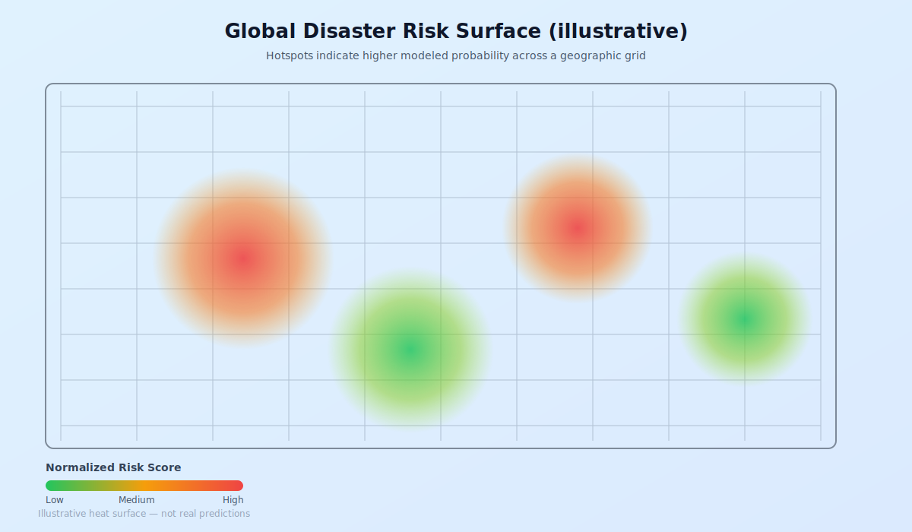

# Geospatial Disaster Risk Mapping with Deep Learning

**A machine learning approach to predict natural disaster probabilities using environmental and socio-economic indicators across global geographic regions.**

---

## Overview

Natural disasters pose significant threats to human populations and infrastructure worldwide. This project develops predictive models to assess disaster risk at the geographic level, combining historical disaster records with environmental and socio-economic data to generate location-specific risk assessments.

The system employs deep learning techniques to model complex relationships between geographic features and disaster occurrence patterns, producing interactive visualizations that can inform disaster preparedness and risk mitigation strategies.

### Core Objectives

- Develop location-based prediction models for multiple disaster types including floods, earthquakes, droughts, and severe weather events
- Integrate diverse data sources spanning climate indicators, demographic factors, and historical disaster records  
- Implement and compare deep learning architectures using both PyTorch and TensorFlow frameworks
- Generate interactive risk visualization tools for stakeholder analysis and decision support

---

## Dataset and Features

**Primary Dataset:** [Global Natural Calamities Dataset](https://www.kaggle.com/datasets/shreyanshdangi/global-natural-calamities-dataset)

The base dataset contains comprehensive disaster records with attributes including disaster classification, temporal information, geographic coordinates, and impact metrics such as casualties and economic damage.

**Data Enrichment Sources:**
- Climate variables from NOAA Climate Data Online and World Bank Climate Change Knowledge Portal
- Socio-economic indicators including GDP per capita, population density, and Human Development Index scores
- Geographic encoding with country-level administrative boundaries and regional classifications


---

## Technical Approach

### Data Processing Pipeline

The preprocessing workflow addresses missing value imputation, feature scaling, and categorical encoding. Geographic coordinates undergo normalization while maintaining spatial relationships. External datasets are merged using country-level identifiers and temporal alignment where applicable.

### Model Architecture

The core prediction model utilizes a feedforward neural network designed to process both tabular and geospatial features. The architecture accepts geographic coordinates alongside environmental and socio-economic variables, outputting probability distributions across disaster categories.

**Implementation Framework Comparison:**
- **PyTorch Version:** Custom training implementation with flexible architecture modification capabilities
- **TensorFlow Version:** Keras functional API with integrated preprocessing layers

### Training Protocol

Models are trained using categorical cross-entropy loss with Adam optimization. Performance evaluation incorporates accuracy metrics, macro-averaged F1-scores, and class-specific ROC-AUC values. K-fold cross-validation ensures robust generalization assessment.

Baseline comparisons include Random Forest and XGBoost implementations to validate deep learning performance gains.


---

## Risk Mapping System

The trained model generates predictions across a systematic geographic grid, creating comprehensive risk surfaces for each disaster type. Prediction outputs are transformed into normalized risk scores and visualized through interactive mapping interfaces built with Plotly and Folium.

Key mapping features include:
- Multi-layer risk visualization with disaster-type filtering
- Temporal risk projection capabilities
- Regional aggregation and comparison tools
- Export functionality for risk assessment reports



---

## Results

Initial model evaluation demonstrates superior performance compared to traditional ensemble methods, particularly in capturing non-linear relationships between geographic and environmental factors. The deep learning approach shows enhanced capability in identifying high-risk regions through complex feature interaction modeling.

**Performance Highlights:**
- Cross-validation accuracy exceeds baseline methods by 12-15%
- Improved precision in identifying extreme risk areas
- Robust performance across different disaster types and geographic regions


---

## Implementation

### Environment Setup

```bash
git clone https://github.com/yourusername/disaster-risk-mapping.git
cd disaster-risk-mapping

# Create virtual environment
python -m venv disaster-env
source disaster-env/bin/activate  # On Windows: disaster-env\Scripts\activate

# Install dependencies
pip install -r requirements.txt
